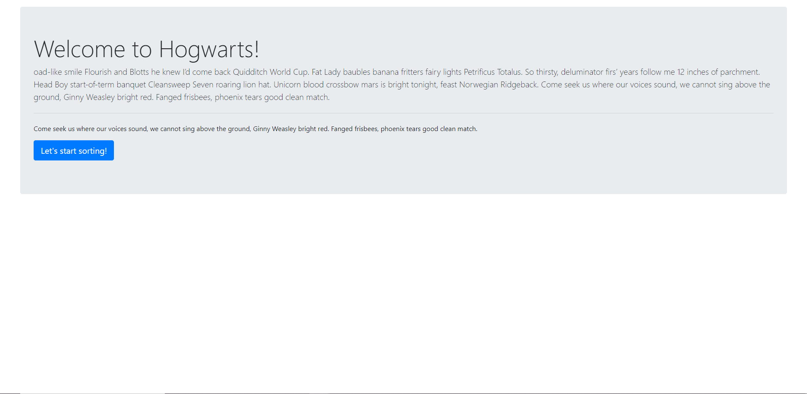
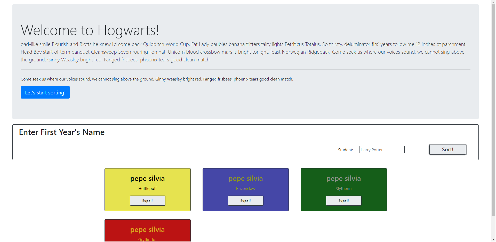

# Hat Exercise

## Description

This project is an exploration into the Bootstrap.
We used a Bootstrap jumbotron to display a form that can create boostrap cards with different house name from harry potter.
The color of each card is based on which house you get and you can also expel a card from the collection.

## Screenshots

## How to Run

1. Clone down this repo
1. Make sure you have http-server installed via npm. If not get it
   [here](https://www.npmjs.com/package/http-server)
1. On your command line run `hs -p 8080`
1. In your browser go to `http://localhost:8080`